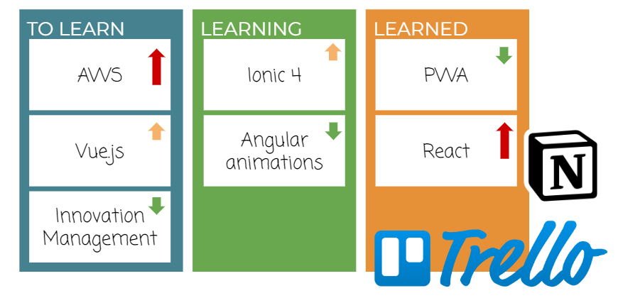

## 🤩 Dicas pra ficar antenado

### 1. Construa uma base sólida

Aprenda:
- Lógica de programação
- Uma linguagem de programação
- Princípios de algoritmos
- Orientação a objetos

Essa base vai te sustentar ao longo da sua carreira, mas não se esqueça de que ela também precisa de reparos. Ou seja, mesmo quando já estiver trabalhando e com anos de experiência, revisite esses tópicos eventualmente.

### 2. Busque fontes confiáveis

Filtre suas fontes
- há conteúdo demais e nem todos agregam
- procure indicações e newsletters

### 3. Escolha o que estudar

A escolha de uma tecnologia depende da necessidade e do conhecimento do desenvolvedor.

#### 3.1. Avalie as techs

Alguns pontos a serem analisados quando você vai escolher algo para estudar:
- Quem está usando?
- Como é o github/documentação dessa tech?
- A comunidade é ativa?
- Qual é a curva de aprendizado?
- Novas versões frequentes?

#### 3.2. Crie uma lista de prioridades

- Use uma ferramenta qualquer para criar listas de items para estudo. Sugestão: trello ou notion
- Essa lista deve ser priorizada de acordo com a importância e urgência daquilo que você precisa estudar
- Essa lista é muito dinâmica e pode ser modificada com constância
    - inclua prioridade em cada item e mude de acordo com a necessidade
    - inclua ou remova items sempre que achar necessário
    - mantenha ATUALIZADO!

### 4. Reserve tempo

#### 4.1. Pra estudar

- Use técnicas que funcionem para você
- O importante é a consistência
- Não se sobrecarregue!

Sugestão de canal no YT com dicas de estudo muito boas: [Thomas Frank](youtube.com/c/Thomasfrank)

#### 4.2. Pra praticar
- Prática é o que realmente dá XP
- Consistência
- Crie um portfólio de práticas

Crie um portfolio de práticas no GitHub e no [Codepen](https://codepen.io)

### 5. Compartilhe e participe

Ensinar ainda é a melhor forma de aprender!
- escreva artigos
- crie projetos abertos
- participe de open source
- meetups
- etc

### 6. Busque ajuda e crie sua rede

#### 6.1. Networking
- Criar relacionamentos com outros profissionais da área

#### 6.2. Mentoria
- Profissionais mais experientes podem te ajudar com dicas e experiências que já viveram

### Dicas bônus

#### Siga seu ritmo

- Paciência é fundamental
- Não há atalhos fáceis, experiência demanda tempo
- Não adianta sair estudando tudo o que aparece, senioridade demanda mais do que só a parte técnica
- _Você pode chegar mais rápido, mas não cortar o caminho_

#### Siga seu ritmo
- Entenda seus pontos fortes e fracos e o que te motiva
- Aceitar passar por "pontos baixos"
- Saiba procurar ajuda
- Encontre seu estilo de aprendizagem
- Procure feedbacks constantes
- Experiências de vida (maturidade) também contribuem muito
- Busque ter um plano de desenvolvimento da sua carreira (independente do emprego atual)
- _No fim do dia, o que importa não é apenas o salário e o cargo e sim ter propósito e gostar do que faz_

---

### Mais referências:
- [7 Learning Habits for Developers: Reach Skill Goals in Less Time](sitepoint.com/learning-habits-for-developers/?utm_source=rss)
    - > As a developer, it’s important to always be learning. The industry is constantly changing, and if you don’t keep up, you’ll quickly fall behind. In this blog post, we will discuss seven learning habits that every developer should master. These habits will help you stay current in your field, and continue to grow as a professional!

---

[🏠 Voltar para o início](./../../README.md)