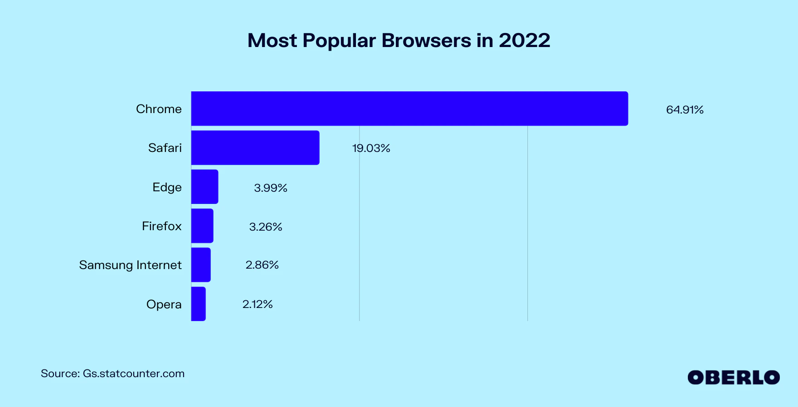

## Browsers (navegadores)

> Um navegador web te leva para qualquer lugar na internet. Ele obtém informações de outras partes da web e as exibe em seu computador ou dispositivo móvel. As informações são transferidas usando o Protocolo de Transferência de Hipertexto, que define como textos, imagens e vídeos são transmitidos na web. Essas informações precisam ser compartilhadas e exibidas num formato consistente, para que as pessoas que usam qualquer navegador, em qualquer lugar do mundo, possam ver as informações.

#### Para estudar
- [A Brief History of Web Browsers and How They Work](https://smartbear.com/blog/history-of-web-browsers/) - We all know the basic functionality of the browser — it’s what connects you with everything on the web. By understanding the history and backend of some major browsers including Chrome, Safari, Internet Explorer (IE), Firefox, and Opera, it’ll be easier to understand what goes into developing and testing a cross-compatible website.
- [web.dev: How browsers work](https://web.dev/howbrowserswork/) - Behind the scenes of modern web browsers
- [Mozilla: O que é um navegador web?](https://www.mozilla.org/pt-BR/firefox/browsers/what-is-a-browser/) - Um navegador web leva você a qualquer lugar na internet, permitindo ver textos, imagens e vídeos de qualquer lugar do mundo.
- [MDN: Caminho de renderização crítico](https://developer.mozilla.org/pt-BR/docs/Web/Performance/Critical_rendering_path) - O caminho de renderização crítico é a sequência de passos que o navegador passa para converter HTML, CSS e JavaScript em pixels na tela. Otimizando o caminho de renderização crítico melhora a performance.
- [Chrome DevTools](https://developer.chrome.com/docs/devtools/) - Chrome DevTools is a set of web developer tools built directly into the Google Chrome browser.